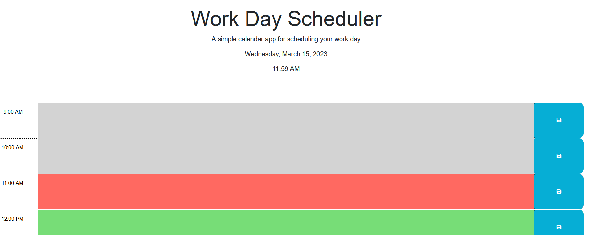

# MVR-bootcamp-challenge-5
## Work Day Scheduler
This repository is used to track the average working day hours of a user making use of local storage.

## Usage
Upon loading up the repository in a web browser, the user will be presented with the current date and time at the top of the screen along with a time block period covering the average working day hours between 9 Am and 5 PM. The user can select time blocks divided into 1 hour periods to enter the tasks/activities/events/meetings/etc and save them into local storage. The scheduler will also update teh time and background colors of the time blocks reflecting a past/present/future appearance to assist the user in focusing on completing the items they add into the scheduler. 

[Deployed application](https://vrich88.github.io/MVR-bootcamp-challenge-5/)

## Contributors
Consulting and guidance used in creation of this repository include peers and resources (in no order) as follows:
    •Matt Montiel 
    •Julie Schuab 
    •Rachel Solov 

## License
MIT License

Copyright (c) 2023 vrich88

Permission is hereby granted, free of charge, to any person obtaining a copy
of this software and associated documentation files (the "Software"), to deal
in the Software without restriction, including without limitation the rights
to use, copy, modify, merge, publish, distribute, sublicense, and/or sell
copies of the Software, and to permit persons to whom the Software is
furnished to do so, subject to the following conditions:

The above copyright notice and this permission notice shall be included in all
copies or substantial portions of the Software.

THE SOFTWARE IS PROVIDED "AS IS", WITHOUT WARRANTY OF ANY KIND, EXPRESS OR
IMPLIED, INCLUDING BUT NOT LIMITED TO THE WARRANTIES OF MERCHANTABILITY,
FITNESS FOR A PARTICULAR PURPOSE AND NONINFRINGEMENT. IN NO EVENT SHALL THE
AUTHORS OR COPYRIGHT HOLDERS BE LIABLE FOR ANY CLAIM, DAMAGES OR OTHER
LIABILITY, WHETHER IN AN ACTION OF CONTRACT, TORT OR OTHERWISE, ARISING FROM,
OUT OF OR IN CONNECTION WITH THE SOFTWARE OR THE USE OR OTHER DEALINGS IN THE
SOFTWARE.
